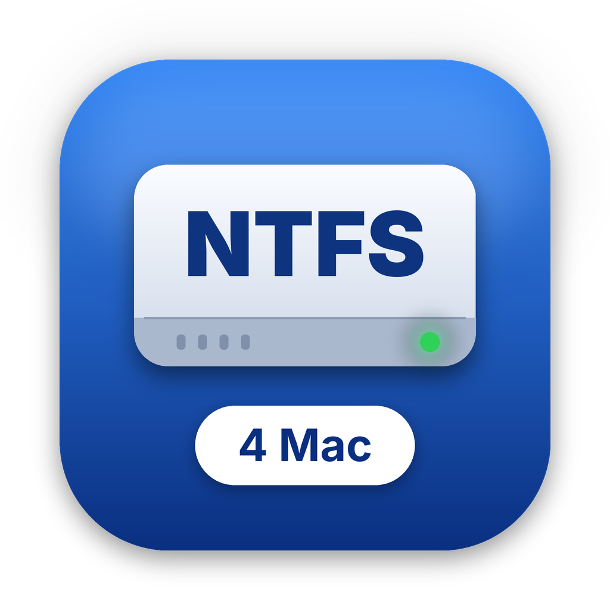

<p align="center"></p>

# NTFS4Mac

**Author / developer: [Vahid Zekic](https://github.com/vahidzekic)**

A native, user-space **read/write NTFS driver for macOS 15.4+**, built as an
Apple **FSKit** file-system module around **libntfs-3g** (the engine behind
ntfs-3g). It lets Finder, `mount` and Disk Arbitration (automount,
`diskutil mount`) use Windows NTFS volumes for reading and writing, and it
formats volumes as NTFS through FSKit's `newfs_fskit`. It does not need a
kernel extension or macFUSE, and you do not have to lower system security to
use it.

> **License:** GPL-2.0-or-later (use under GPL-2.0 or GPL-3.0) — built on
> [tuxera/ntfs-3g](https://github.com/tuxera/ntfs-3g). See [License](#license).
>
> **Status:** Work in progress. The C bridge over libntfs-3g is complete and
> its host-side self-test passes (13064 checks at 512- and 4096-byte block
> sizes, clean under ASan/UBSan on Linux). The FSKit extension builds
> with Xcode on macOS 26.5 and has been exercised on an Intel Mac with RAM
> disks: format (`newfs_fskit` and `diskutil eraseDisk`), mount, read/write,
> rename, symlinks, delete and remount. It has **not** yet been tested on
> Apple Silicon or on disks formatted by Windows.
>
> **Data-loss warning:** Writing to NTFS from a non-Windows implementation
> always carries some risk, and this project is new and has not been
> battle-tested. **Back up everything** before you mount a volume with
> important data read/write. Shut Windows down fully (no hibernation, no
> "Fast Startup") before you move a disk to the Mac. Run `chkdsk` from
> Windows whenever a volume is marked dirty. If you are unsure, use the
> `rdonly` mount option.

---

## Table of contents

- [Features](#features)
- [Known limitations](#known-limitations)
- [Why FSKit?](#why-fskit)
- [Names: `ntfs4mac` vs. `ntfs`](#names-ntfs4mac-vs-ntfs)
- [Architecture](#architecture)
  - [Data flow](#data-flow)
  - [Components](#components)
  - [Key design decisions](#key-design-decisions)
  - [Upstream workarounds](#upstream-workarounds)
- [Requirements](#requirements)
- [Quick start](#quick-start)
  - [1. Build libntfs-3g](#1-build-libntfs-3g)
  - [2. Build, sign and install](#2-build-sign-and-install)
  - [3. Enable the extension](#3-enable-the-extension)
  - [4. Make a test volume](#4-make-a-test-volume)
  - [5. Mount and unmount](#5-mount-and-unmount)
  - [6. Check and format](#6-check-and-format)
- [Mount options](#mount-options)
- [Check options](#check-options)
- [Format options](#format-options)
- [Ownership and permissions](#ownership-and-permissions)
- [Hibernated and Fast Startup volumes](#hibernated-and-fast-startup-volumes)
- [Debugging](#debugging)
- [Troubleshooting / FAQ](#troubleshooting--faq)
- [Project layout](#project-layout)
- [Roadmap](#roadmap)
- [Contributing](#contributing)
- [Installer and releases](#installer-and-releases)
- [Author](#author)
- [License](#license)
- [Credits](#credits)

---

## Features

| Feature | Notes |
|---|---|
| **Read and write** | Reads and writes file data through the unnamed `$DATA` stream, at any offset and length (unaligned IO is bounced to the device block size). Files grow as you write to them and can be truncated or extended. |
| **Create / rename / delete** | Files and directories. Rename follows POSIX semantics: it replaces an existing destination, returns `ENOTEMPTY` for a non-empty destination directory, `EINVAL` when you move a directory into its own subtree, and supports case-only renames. |
| **Hard links** | NTFS natively supports multiple names per MFT record. `nlink` is reported. |
| **Symbolic links** | A relative target that exists on the volume is stored as a **native Windows symlink** (reparse point with `SYMLINK_FLAG_RELATIVE`), which Windows follows. Anything else (absolute paths, dangling targets, names Windows would misparse) is stored as a **WSL symlink**, understood by WSL and ntfs-3g. Existing native symlinks, WSL symlinks and **junctions** are reported as symlinks; absolute Windows targets such as `C:\dir` are turned into paths relative to the link, so they work wherever the volume is mounted. |
| **Timestamps and flags** | Access, modify, change and birth (creation) times. `atime` is **not** updated on read (ntfs-3g "noatime" behaviour, so reads never write the MFT). `HIDDEN` maps to `UF_HIDDEN`. `READONLY` maps to `UF_IMMUTABLE` **on files only** (Windows uses READONLY on folders as a customisation marker). `SYSTEM` and `ARCHIVE` are preserved. |
| **Format** | `mkntfs` runs **in-process** inside the extension, and every sector it writes goes to the FSKit block device. Run it with `newfs_fskit -t ntfs4mac`. Quick format is the default. Options cover the label, cluster size, hidden sectors, full format and compression. Progress and cancellation are reported to FSKit. |
| **Check** | `fsck_fskit -t ntfs4mac` and Disk Arbitration's pre-mount check: validates the boot sector, reports dirty/hibernated state and volume statistics, and with `-y` resets an unclean journal. Not a full `chkdsk`. |
| **Probe and automount** | Recognises NTFS on MBR type 0x07 partitions, GPT "Microsoft Basic Data" partitions and unpartitioned media. Reports the label and a stable UUID (version 5, derived from the NTFS serial number). |
| **Hibernation and dirty detection** | Detects `hiberfil.sys`, Windows Fast Startup metadata caching and unclean journals. A read/write mount of a hibernated volume **falls back to read-only automatically**. See [Hibernated and Fast Startup volumes](#hibernated-and-fast-startup-volumes). |
| **Volume label rename** | Renames the label of a mounted volume (up to 32 UTF-16 code units). |
| **Unicode names** | The UI shows UTF-8. On disk, names are stored as NTFS UTF-16LE (up to 255 units). DOS 8.3 short names are hidden. |
| **Case sensitivity** | **Case-insensitive, case-preserving by default** (`ignore_case`), like Windows. `-o case_sensitive` gives NTFS POSIX-namespace semantics for one mount. |
| **Hidden metadata** | `$MFT`, `$Bitmap` and the other metadata files are hidden unless you set `show_sys_files`. Files with the Windows `HIDDEN` attribute are always listed (Finder hides them via `UF_HIDDEN`). |
| **Compression** | Compressed files can be read and written. New files inherit compression from compressed directories. |

## Known limitations

- **Limited real-world testing.** See the status note at the top: tested on
  RAM disks on one Intel Mac so far.
- **No full `chkdsk`/repair.** The check can detect a dirty, unclean or
  hibernated volume and can reset the journal (`-y`, or the default
  `recover` mount option), but it cannot repair a corrupted file system. Use
  Windows `chkdsk /f` for that.
- **No POSIX ownership mapping.** NTFS stores Windows security descriptors,
  not uid/gid. Every item is reported with the mount's uid/gid and a mode
  derived from `fmask`/`dmask`. `chown`/`chgrp` are accepted but have no
  effect. See [Ownership and permissions](#ownership-and-permissions). There
  is no support for ntfs-3g user mapping files.
- **Encrypted (EFS) files are not supported.** They are flagged, and opening
  their contents fails with `EACCES`.
- **No extended attributes or alternate data streams (ADS).** Only the
  unnamed `$DATA` stream is exposed, and the volume does not implement
  FSKit's xattr operations. macOS then falls back to AppleDouble `._*` files
  for Finder metadata (tags, quarantine, resource forks).
- **Sparse files** are reported through a flag. There is no hole-punching
  API.
- **Performance:** libntfs-3g is not thread-safe, so all operations on a
  given volume are serialised. Concurrent IO from many apps to the same
  volume will not scale. All data IO goes through user space (no
  kernel-offloaded IO).
- **Disk Utility needs a second install step.** Disk Utility and `diskutil`
  take their format list from `*.fs` bundles, not from FSKit modules. Run
  `scripts/install-fs-bundle.sh` once to install `/Library/Filesystems/ntfs4mac.fs`;
  "NTFS" then appears in Erase › Format. See
  [Check and format](#6-check-and-format).
- **Physical disks with `mount -F`** can fail with `EACCES` opening
  `/dev/rdiskN` (a known FSKit permission issue acknowledged by Apple DTS).
  Use disk images or RAM disks for `mount -F` testing, and Disk Arbitration
  (`diskutil mount`, automount) for real disks.

## Why FSKit?

| Approach | Drawbacks | ntfs4mac (FSKit) |
|---|---|---|
| **Kernel extension (kext)** | On Apple Silicon you have to lower security in Recovery to load third-party kexts. A bug can panic the machine. Apple has deprecated the model. | Runs entirely in **user space**, in a **sandboxed app extension**. A crash takes down only the extension process. |
| **macFUSE** | Installs its own kernel extension, or uses its FSKit-based backend that is still evolving. Needs a separate install and approval. The ntfs-3g FUSE daemon runs with broad device access. | Uses **Apple's own FSKit** framework, which ships with macOS 15.4+. Nothing to install apart from the app. `fskitd` opens the block device and hands the extension only the resource it is allowed to use. |
| **Apple's built-in NTFS** | **Read-only.** Cannot format. | Read **and write**, plus formatting, label rename, symlinks and hard links. |

FSKit modules are **ExtensionKit app extensions**, not System Extensions or
kexts. SIP stays on, `systemextensionsctl` does not apply (it will not list
the module), and no reboot or kernel-extension consent is needed. `mount -F`,
Disk Arbitration, `fsck_fskit` and `newfs_fskit` talk to `fskitd`, which
loads the extension on demand over XPC. The extension never opens
`/dev/disk*` itself.

## Names: `ntfs4mac` vs. `ntfs`

| Name | Value | Where it is used |
|---|---|---|
| `FSShortName` | **`ntfs4mac`** | The file-system type for `mount -t`, `fsck_fskit -t`, `newfs_fskit -t`. Disk Arbitration records it as the volume kind. |
| Personality key | `NTFS4Mac` | `FSPersonalities` key; what `diskutil` would match if it listed FSKit personalities. |
| Personality `FSName` | `NTFS` | Human-readable name in UI surfaces that show the personality. |
| statfs type (`fileSystemTypeName`) | `ntfs` | What `mount`, `df` and Finder's Get Info report for a mounted volume. |

Why not `FSShortName = ntfs`? macOS already ships a **read-only** NTFS
driver (`/System/Library/Filesystems/ntfs.fs`, kext-backed) that owns that
name. Apple engineers state that when a kext and an FSKit module share a
short name, the kext is preferred, so `mount -t ntfs` and automount would
keep picking Apple's read-only driver. Another third-party FSKit NTFS module
that used `ntfs` reported that `fskitd` refused its mounts with
`ECONNREFUSED`. A unique short name keeps `mount -t ntfs4mac` unambiguous.
The personality key is `NTFS4Mac` rather than `NTFS` for the same reason.
Full sources and reasoning: [`docs/FSKIT_MANIFEST.md`](docs/FSKIT_MANIFEST.md#fsshortname-and-personality-decision).

## Architecture

The binding design is in [`docs/ARCHITECTURE.md`](docs/ARCHITECTURE.md) and
the frozen C API is in
[`NTFSExtension/Bridge/NTFSBridge.h`](NTFSExtension/Bridge/NTFSBridge.h).
Every FSKit API used, with verified signatures, is in
[`docs/FSKIT_NOTES.md`](docs/FSKIT_NOTES.md). Every `Info.plist` and
entitlement key, with sources, is in
[`docs/FSKIT_MANIFEST.md`](docs/FSKIT_MANIFEST.md).

### Data flow

```
 Finder / mount -F / Disk Arbitration / fsck_fskit / newfs_fskit
        │  probe, load, activate, check, format requests
        ▼
     fskitd  ──── XPC ────►  NTFSExtension.appex   (sandboxed, user space)
                                   │
          NTFSFileSystem  (FSUnaryFileSystem)       probe / load / unload / check / format
                                   │                (loadResource only hands over the device)
          NTFSVolume  (FSVolume.Operations,         activate (mounts NTFS) / deactivate,
                       ReadWriteOperations, ...)     lookup / enumerate / read / write /
                                   │                 attributes / create / rename / remove
                                   │   Swift → C   (NTFSBridgeSwift.swift)
                                   ▼
          NTFSBridge.c  ── per-volume mutex ──►  libntfs-3g
                                   │               (ntfs_device_mount, ntfs_readdir, ntfs_attr_pread, ...)
                                   │   struct ntfs_device_operations (ntfsb_devio.c,
                                   │   aligned bounce buffers)
                                   ▼
          ntfsb_io callbacks  (BlockDeviceIO.swift)
                                   │
                                   ▼
          FSBlockDeviceResource.read / write
                                   │
                                   ▼
          /dev/diskXsY   (opened by fskitd, never by the extension)
```

Formatting follows the same path, except that `ntfsb_format()` calls the
`mkntfs` code compiled into the bridge (`mkntfs_glue.c`) instead of
libntfs-3g's mount path.

### Components

| File | Responsibility |
|---|---|
| `project.yml` | XcodeGen spec that generates `NTFS4Mac.xcodeproj` (gitignored). Deployment target macOS 15.4; the extension is an `extensionkit-extension`. |
| `NTFS4Mac/NTFS4MacApp.swift` | SwiftUI host app. It is the container that FSKit requires. It shows whether FSKit considers the module enabled and opens the System Settings pane. |
| `NTFS4Mac/Info.plist`, `NTFS4Mac.entitlements` | Host app metadata and entitlements. |
| `NTFSExtension/Info.plist` | `EXAppExtensionAttributes`: `FSShortName` (`ntfs4mac`), `FSPersonalities` (`NTFS4Mac`), `FSMediaTypes`, and the activate/check/format option syntax. Authoritative for names; documented in `docs/FSKIT_MANIFEST.md`. |
| `NTFSExtension/NTFSExtension.entitlements` | `com.apple.developer.fskit.fsmodule` and the App Sandbox. |
| `NTFSExtension/NTFSExtensionMain.swift` | `@main` `UnaryFileSystemExtension` entry point. |
| `NTFSExtension/NTFSFileSystem.swift` | `FSUnaryFileSystem`: probe, load, unload, check and format, plus the mount/check/format option parsers (the authority for the option strings). |
| `NTFSExtension/NTFSVolume.swift` | `FSVolume` plus `Operations`, `ReadWriteOperations`, `OpenCloseOperations` and `RenameOperations`. Mounts NTFS in `activate` (with the read-only fallback) and maps FSKit calls to `NTFSMount`. |
| `NTFSExtension/NTFSItem.swift` | `FSItem` subclass that carries the MFT record number (`ino`) and a cached type. |
| `NTFSExtension/NTFSBridgeSwift.swift` | Swift wrappers over the C API: `NTFSMount`, `NTFSError`, `NTFSStat`, `NTFSMountOptions`, `NTFSFormatOptions`, and so on. |
| `NTFSExtension/BlockDeviceIO.swift` | Adapts `FSBlockDeviceResource` to the `ntfsb_io` callback table. |
| `NTFSExtension/NTFSExtension-Bridging-Header.h` | Imports `Bridge/NTFSBridge.h` into Swift. |
| `NTFSExtension/Bridge/NTFSBridge.h` | **Frozen** C API between Swift and libntfs-3g. |
| `NTFSExtension/Bridge/NTFSBridge.c` | Implements the C API on top of libntfs-3g (UTF-8/UTF-16 conversion, errno mapping, locking, symlinks, hibernation detection). |
| `NTFSExtension/Bridge/ntfsb_devio.c/.h` | `ntfs_device_operations` backed by `ntfsb_io`, with read-modify-write bouncing for unaligned IO. |
| `NTFSExtension/Bridge/mkntfs_glue.c/.h` | Runs mkntfs in-process, with its device IO redirected to `ntfsb_io` and its global state reset between runs. |
| `scripts/build-libntfs3g.sh` | Downloads NTFS-3G 2022.10.3 (sha256-pinned) and builds static, FUSE-free `libntfs-3g.a` and `libmkntfs.a` (universal arm64 + x86_64) plus host tools into `ThirdParty/ntfs-3g/`. |
| `scripts/dev-install.sh` | Generates the project, builds, verifies the signature and entitlements, installs to `/Applications` and registers the extension. |
| `Tests/bridge/` | Host-side (Linux/macOS) C self-test of the bridge against image files. |
| `docs/` | `ARCHITECTURE.md`, `TESTING.md`, `FSKIT_NOTES.md`, `FSKIT_MANIFEST.md`. |

### Key design decisions

- **Mount in `activate`, not `loadResource`.** FSKit runs `startCheck` and
  `startFormat` after `loadResource`, on the same resource. So
  `loadResource` only probes (for logging), wraps the block device and
  creates the `NTFSVolume`; it accepts non-NTFS devices so they can be
  formatted. NTFS is mounted in `FSVolume.Operations.activate` and
  unmounted in `deactivate`. Mount options from both `loadResource` and
  `activate` are parsed and merged.
- **Errno convention.** Every bridge function returns `0` on success or a
  **positive POSIX errno** on failure. The bridge never uses the global
  `errno`. Swift converts the result with `NTFSError.check(_:)` into
  `POSIXError`, which is what FSKit reply handlers expect. A read/write
  mount that returns `EPERM` means the volume is hibernated, cached by Fast
  Startup or unclean, but otherwise mountable read-only.
- **Inode identity.** An `FSItem` is identified by its NTFS **MFT record
  number** (the low 48 bits of the MFT reference). The root directory is
  `NTFSB_ROOT_INO` (5). Records 0–15 are NTFS metadata and refuse
  attribute changes. `NTFSVolume` keeps a lock-guarded `[UInt64: NTFSItem]`
  cache, and `reclaimItem` evicts entries from it. The MFT sequence number
  is reported as `generation`.
- **Per-volume mutex.** libntfs-3g is not thread-safe. The bridge serialises
  every call on one volume through a mutex that it owns, so Swift can call in
  from any task without extra locking, apart from locks around its own
  caches. `ntfsb_format()` is serialised **process-wide** because mkntfs
  uses global state.
- **Aligned IO bouncing.** The `ntfsb_io` callbacks, and therefore
  `FSBlockDeviceResource`, only ever see offsets and lengths that are
  multiples of the device block size (512 or 4096). The C device layer does
  read-modify-write bouncing for anything that is not aligned. The self-test
  `abort()`s on any unaligned request to prove it.
- **mkntfs in-process, with redirected device ops.** mkntfs is a program,
  not a library. The build script compiles `ntfsprogs/mkntfs.c` into
  `libmkntfs.a` with `-include NTFSExtension/Bridge/mkntfs_glue.h`, which
  renames `main` to `ntfsb_mkntfs_main`, routes its device-IO table
  (`ntfs_device_unix_io_ops`) to `ntfsb_mkntfs_io_ops`, renames `exit`, and
  adds `ntfsb_mkntfs_reset_state()`. `ntfsb_format()` then builds an argv
  (always `-F -s <blocksize> -p <hidden> -H 255 -S 63`, plus `-Q`, `-C`,
  `-L label`, `-c size` as requested, then a dummy device name and the
  sector count) and calls it, so every sector mkntfs writes goes through
  the FSKit resource.
- **No `/dev` access.** The extension never opens device nodes. `fskitd`
  owns the device and passes in an `FSBlockDeviceResource`.
- **Reply-handler FSKit API.** The deployment target is macOS 15.4, so the
  module uses the `FSVolume.Operations` reply-handler protocols, not the
  macOS 27 `FSVolume.Handler` family.
- **Swift 6, strict concurrency.** Wrapper types are `Sendable`. `NTFSMount`
  owns the `ntfsb_volume*` and keeps the `BlockDeviceIO` alive until
  unmount. Each FSKit method does its work synchronously before replying.

### Upstream workarounds

The bridge works around two problems in libntfs-3g / ntfsprogs 2022.10.3:

- **`ntfs_readdir()` index-bitmap resume bug.** When a directory listing
  resumes inside `$INDEX_ALLOCATION` at block *n*, libntfs-3g reads the
  `$BITMAP` byte *n/8* but tests bits from 0 instead of *n%8*, so it checks
  the wrong "in use" bits and eventually reads past the end (`EIO`). The
  bridge resumes at the first block of that bitmap byte and drops the
  re-scanned entries before the cookie. The self-test resumes a 300-entry
  directory from every cookie.
- **mkntfs is not re-entrant.** It leaves `g_allocation` dangling and leaks
  `g_upcaseinfo` after each run, so a second in-process format would be a
  use-after-free. The glue resets mkntfs's global state before every run.

## Requirements

- A Mac with **Apple Silicon** (default `arm64` build) or Intel (universal
  builds work: `ARCHS="arm64 x86_64"`).
- **macOS 15.4 or later**, the first release with public FSKit.
  **macOS 15.6+ (or 26.x) is recommended**: on 15.4/15.5 Disk Arbitration
  fails to probe FSKit modules (FB17772372), so automount only works from
  15.6. `mount -F` works on 15.4.
- **Xcode 16.3 or later** (the FSKit SDK and the File System Extension
  template first shipped in 16.3), selected with `xcode-select`.
- **Homebrew** tools:
  ```sh
  brew install xcodegen autoconf automake libtool pkg-config gettext
  ```
  Only `xcodegen` and `pkg-config` are strictly needed with the Tuxera
  release tarball; autotools are needed for the GitHub fallback.
- A **paid Apple Developer Program team** for code signing. The extension
  must be signed with `com.apple.developer.fskit.fsmodule`; `fskitd` refuses
  modules without it, and ad-hoc signing does not work. Enable the **FSKit
  Module** capability on the App ID `com.vahidzekic.ntfs4mac.NTFSExtension`;
  Xcode automatic signing then creates the profile. (Whether a free Personal
  Team works is unverified.)

## Quick start

> The authoritative, step-by-step procedure, with expected output and
> troubleshooting, is [`docs/TESTING.md`](docs/TESTING.md). The commands
> below are an overview. Test on disk images or RAM disks, never on a disk
> that holds data you care about.

### 1. Build libntfs-3g

```sh
scripts/build-libntfs3g.sh
```

This downloads `ntfs-3g_ntfsprogs-2022.10.3.tgz` (sha256-pinned; Tuxera
mirror, then GitHub fallback), configures it with `--disable-ntfs-3g
--disable-plugins --disable-crypto` (no FUSE, no macFUSE), and installs
universal `libntfs-3g.a` and `libmkntfs.a`, the headers, and host tools
(`mkntfs`, `ntfsinfo`, `ntfsls`, `ntfscat`, `ntfsfix`) into
`ThirdParty/ntfs-3g/`. `ThirdParty/` is gitignored. Run it with `--clean` to
rebuild; `NTFS3G_VERSION`, `NTFS3G_SHA256`, `NTFS3G_ARCHS` and friends are
documented at the top of the script.

### 2. Build, sign and install

```sh
export DEVELOPMENT_TEAM=ABCDE12345     # from: security find-identity -v -p codesigning
scripts/dev-install.sh                 # xcodegen + xcodebuild + codesign checks + /Applications + pluginkit
scripts/dev-install.sh --restart-agent --open-settings
```

`dev-install.sh` also accepts `--release` and `--no-install`. It installs a
single copy in `/Applications` and unregisters the DerivedData copy, because
two registered copies of one bundle id make it unpredictable which one
`fskit_agent` launches.

By hand:

```sh
xcodegen generate                       # → NTFS4Mac.xcodeproj
xcodebuild -project NTFS4Mac.xcodeproj -scheme NTFS4Mac -configuration Debug \
  -destination platform=macOS -derivedDataPath build/DerivedData -allowProvisioningUpdates \
  -allowProvisioningDeviceRegistration \
  DEVELOPMENT_TEAM=$DEVELOPMENT_TEAM build
```

The extension links `-lmkntfs -lntfs-3g` (in that order) plus
`FSKit.framework`. Verify the entitlement:

```sh
codesign -d --entitlements - --xml \
  /Applications/NTFS4Mac.app/Contents/Extensions/NTFSExtension.appex | plutil -p -
#   "com.apple.developer.fskit.fsmodule" => true
#   "com.apple.security.app-sandbox" => true
```

### 3. Enable the extension

This is required, per user, and again after each reinstall:

1. System Settings → **General → Login Items & Extensions**.
2. Under **Extensions**, choose **By Category**.
3. Click **ⓘ** next to **File System Extensions**.
4. Turn on **NTFS (ntfs4mac)** → **Done**.

The NTFS4Mac app's **Open System Settings…** button opens this pane. Check
the registration:

```sh
pluginkit -mAvvv -p com.apple.fskit.fsmodule
```

The `pluginkit` "+" mark is **not** FSKit's enable switch; FSKit keeps its
own list, which the app's status line reports.

### 4. Make a test volume

```sh
# Partitionless image, formatted with the host mkntfs
mkfile -n 512m /tmp/ntfs.img
ThirdParty/ntfs-3g/bin/mkntfs -F -Q -L NTFSTEST /tmp/ntfs.img
hdiutil attach -imagekey diskimage-class=CRawDiskImage -nomount /tmp/ntfs.img
#   /dev/disk7   (-nomount stops Disk Arbitration from auto-mounting)

# Or a RAM disk (the most reliable target for mount -F), formatted by ntfs4mac itself
DEV=$(hdiutil attach -nomount ram://1048576 | awk '{print $1}')   # 512 MiB
newfs_fskit -t ntfs4mac -L NTFSTEST $DEV
```

`docs/TESTING.md` §5b also shows how to build a GPT disk with a
"Microsoft Basic Data" partition.

### 5. Mount and unmount

**Run mounts as your login user, not with `sudo`.** FSKit mounts belong to
the user's session; on macOS 26, `sudo mount -F …` fails with
"entitlement no" in the `fskitd` log (third-party report).

```sh
mkdir -p /tmp/ntfs
mount -F -t ntfs4mac /dev/disk7 /tmp/ntfs                  # read-write
mount -F -t ntfs4mac -o rdonly /dev/disk7 /tmp/ntfs        # read-only
mount -F -t ntfs4mac -o uid=$(id -u),gid=$(id -g) /dev/disk7 /tmp/ntfs

mount | grep /tmp/ntfs                                     # type shows as ntfs
umount /tmp/ntfs                                           # or: diskutil unmount /tmp/ntfs
hdiutil detach /dev/disk7
```

`-F` forces `mount(8)` to use FSKit. Because `ntfs4mac` is a unique FSKit
name, `mount -t ntfs4mac …` also works without it. Without `-F`, a type with
no enabled FSKit module makes `mount` look for
`/Library/Filesystems/<type>.fs/…/mount_<type>` and fail with "No such file
or directory".

**Automount.** Attach an image without `-nomount`, or run
`diskutil mount /dev/diskXsY`. On macOS 15.6+, Disk Arbitration probes the
modules whose `FSMediaTypes` match, runs a check with `-q` (then `-y` if
that fails), and mounts under `/Volumes/<label>`. Apple's built-in read-only
`ntfs` kext is preferred over FSKit modules; if `mount` shows the volume
`read-only` from Apple's driver, unmount and mount again, or use
`mount -F -t ntfs4mac`.

### 6. Check and format

macOS 15.4+ ships `/sbin/fsck_fskit` and `/sbin/newfs_fskit`, which run the
module's `startCheck` / `startFormat` tasks. Options after the type are
parsed with the module's getopt strings. Check `man fsck_fskit` and
`man newfs_fskit` for the exact argument order on your OS.

```sh
fsck_fskit -t ntfs4mac -n /dev/disk7                   # report only
fsck_fskit -t ntfs4mac -y /dev/disk7                   # repair (journal reset)

# Format — destroys all data; the device must not be mounted
newfs_fskit -t ntfs4mac -L NTFSTEST /dev/disk8                 # quick format (default)
newfs_fskit -t ntfs4mac -L DATA -c 65536 -f /dev/disk8         # 64 KiB clusters, full format
newfs_fskit -t ntfs4mac -L ARCHIVE -C /dev/disk8               # compression on
```

**Disk Utility and `diskutil eraseVolume`/`eraseDisk`.** Disk Utility and
`diskutil` (through `storagekitd`) list formats from `*.fs` bundles that
declare an `FSFormatExecutable`, as Apple's `exfat.fs` does; FSKit modules
alone never show up. `FilesystemBundle/ntfs4mac.fs` is such a bundle: its
`newfs_ntfs4mac`, `fsck_ntfs4mac` and `mount_ntfs4mac` helpers forward to
`newfs_fskit`, `fsck_fskit` and `mount -F` for this module, running as the
console user (FSKit enablement is per user). Install it once:

```sh
./scripts/install-fs-bundle.sh          # sudo; restarts storagekitd
diskutil listFilesystems | grep NTFS4Mac
#   NTFS4Mac                        NTFS
```

Then reopen Disk Utility: **NTFS** is in Erase › Format. From Terminal:

```sh
diskutil eraseDisk   NTFS4Mac DATA GPT /dev/diskX     # whole disk, GPT + Microsoft Basic Data
diskutil eraseVolume NTFS4Mac DATA /dev/diskXsY       # one partition
```

Verified on macOS 26.5 (Intel) with a RAM disk: `eraseDisk` created a
GPT map with a Microsoft Basic Data partition, formatted it through the
module and mounted it at `/Volumes/<name>` via FSKit. Use the personality key
`NTFS4Mac`; `NTFS` resolves to Apple's read-only `ntfs.fs`, which cannot
erase. `scripts/install-fs-bundle.sh --uninstall` removes the bundle.

## Mount options

Activate option syntax (`FSActivateOptionSyntax`): **`o:rwu:g:`**.

| Option | Effect |
|---|---|
| `-o list` | Comma-separated option list (repeatable; `-olist` and bare lists are also accepted). Entries below. |
| `-r` / `-w` | Read-only / read-write. |
| `-u N` / `-g N` | Owner / group reported for every item (decimal). |

`-o` list entries:

| Entry | Default | Effect |
|---|---|---|
| `rdonly`, `ro` | | Mount read-only. |
| `rw` | ✓ | Mount read-write. |
| `remove_hiberfile` | | If Windows is hibernated, **delete `hiberfil.sys`** and mount read-write. **The hibernated Windows session is lost.** Does not help with Fast Startup cached metadata (see below). |
| `recover` / `norecover` | `recover` | Reset an unclean NTFS journal (`$LogFile`) on a read-write mount. `norecover` refuses unclean volumes instead (they then fall back to read-only). This does not repair corruption. |
| `show_sys_files` / `hide_sys_files` | `hide_sys_files` | Show NTFS metadata files (`$MFT`, `$Bitmap`, …) in the root directory. |
| `ignore_case` / `case_sensitive`, `noignore_case` | `ignore_case` | Case-insensitive, case-preserving lookups (Windows semantics), or case-sensitive (NTFS POSIX namespace). |
| `uid=N`, `gid=N` | 99 / 99 | Owner and group reported for every item. |
| `fmask=OCT` | `022` | Permission bits removed from files (octal). |
| `dmask=OCT` | `022` | Permission bits removed from directories (octal). |
| `umask=OCT` | | Sets both `fmask` and `dmask`. |

Unknown entries (`nosuid`, `nodev`, `nobrowse`, …) are ignored. FSKit's own
`--rdonly` flag may arrive instead of `-o rdonly`; both are accepted (which
one `mount` sends is unverified).

## Check options

Check option syntax (`FSCheckOptionSyntax`): **`nqyfl`**.

| Flag | Effect |
|---|---|
| `-n` | Report only; never write. |
| `-q` | Quick check (what Disk Arbitration runs first): boot sector valid, and fails only if the volume is dirty and not hibernated. |
| `-y` | Repair (Disk Arbitration's second pass): resets an unclean journal and clears the dirty state through a `recover` mount. Hibernated volumes are never written. |
| `-f` | Force a check even if the volume looks clean (the full check always runs without `-q`). |
| `-l` | Accepted and ignored. |

Unknown flags are ignored, so they never block automount. This is **not** a
full `chkdsk`: structural corruption is reported, not fixed.

## Format options

Format option syntax (`FSFormatOptionSyntax`): **`L:v:c:p:QfC`**.

| Option | Effect |
|---|---|
| `-L label`, `-v label` | Volume label, at most 32 UTF-16 code units. `-v` is the `newfs_*` convention. |
| `-c size` | Cluster size in bytes: a power of two from 512 to 2M; `k` and `m` suffixes are accepted (`-c 64k`). Unset means the mkntfs default for the volume size. |
| `-p sectors` | Hidden sectors (partition start written to the boot sector). |
| `-Q` | **Quick format (default):** do not zero the volume. |
| `-f` | Full format: zero the whole volume first. Slow on large disks. |
| `-C` | Enable compression on the volume by default. |

Unknown flags fail with `EINVAL`. The bridge always passes mkntfs
`-F -s <blocksize> -H 255 -S 63` (force, the FSKit device's block size as
the sector size, and standard geometry), plus `-p`. Progress is reported to
FSKit, and cancellation is honoured between mkntfs phases.

## Ownership and permissions

NTFS has no uid/gid, so ownership is synthesised per mount:

- Every item is owned by the mount's `uid`/`gid` (default 99, "unknown").
  `chown`/`chgrp` succeed but change nothing.
- Files get mode `0666 & ~fmask`, directories `0777 & ~dmask` (with the
  default masks: `0644` and `0755`). Symlinks are `0777`.
- The only permission NTFS can store is "not writable": a `chmod` that
  removes all write bits sets the Windows `READONLY` attribute, one that adds
  any write bit clears it. Directories keep their `READONLY` bit unchanged.
- `READONLY` on a **file** is reported as `UF_IMMUTABLE` (`chflags uchg`),
  and `chflags` can set or clear it. It is not reported on directories,
  because Windows sets it on many folders only as a customisation marker and
  `UF_IMMUTABLE` would make them undeletable.

## Hibernated and Fast Startup volumes

Windows *Fast Startup* (on by default) and hibernation leave the volume in a
state that must not be modified from another OS.

- **Detection.** The probe and the bridge detect an active `hiberfil.sys`,
  a `$LogFile` restart page version 2.0 (metadata cached by Fast Startup),
  and an unclean journal.
- **Automatic read-only fallback.** A read-write mount of such a volume gets
  `EPERM` from the bridge, and the volume automatically retries **read-only**
  and logs why. The kernel still sees a read-write mount (the macOS 26.4+
  mount-options API is not used), so writes fail with `EROFS`.
- **Fast Startup cached metadata** can only be mounted read-only.
  `remove_hiberfile` does not change that; boot Windows and shut it down
  fully.
- **`remove_hiberfile`** deletes `hiberfil.sys` and mounts read-write,
  discarding the hibernated Windows session.
- **Unclean journal** (not hibernated): with the default `recover`, a
  read-write mount resets the journal. With `norecover` it falls back to
  read-only.

The best fix is in Windows: turn off Fast Startup (Control Panel → Power
Options → "Choose what the power buttons do"), or use **Restart**, Shift +
**Shut down**, or `shutdown /s /f /t 0`.

## Debugging

**Unified log.** The extension logs with subsystem
`com.vahidzekic.ntfs4mac.NTFSExtension`. `mount` reports little more than an
exit code; the real error is almost always in the `fskitd` log.

```sh
# Extension logs
log stream --level debug --predicate 'subsystem == "com.vahidzekic.ntfs4mac.NTFSExtension"'

# FSKit daemons: loading, probing, mount refusals, enablement
log stream --level debug --predicate 'process IN {"fskitd","fskit_agent","extensionkitservice","diskarbitrationd","mount"} OR subsystem IN {"com.apple.FSKit","com.apple.LiveFS"}'

# After the fact
log show --last 10m --info --debug --predicate \
  'subsystem == "com.vahidzekic.ntfs4mac.NTFSExtension" OR process == "fskitd"'
```

**Attach the Xcode debugger.** The extension runs as its own process,
`NTFSExtension`, started on demand; **Run** in Xcode does not debug it.
Run `sudo DevToolsSecurity -enable` once. Then choose **Debug → Attach to
Process by PID or Name…**, enter `NTFSExtension`, tick **Wait for launch**,
and trigger a mount (`mount -F -t ntfs4mac /dev/diskN /tmp/ntfs`). From a
terminal: `lldb -n NTFSExtension -w`. A paused extension holds up `fskitd`,
so `mount` may time out at a breakpoint. Only Debug builds (with
`get-task-allow`) can be attached to.

**Restarting FSKit components** (see `docs/TESTING.md` §9 for caveats):

| Command | Effect |
|---|---|
| `pkill -f Contents/Extensions/NTFSExtension.appex` | Stops the extension; it relaunches on the next request. Unmount first. |
| `killall -9 fskit_agent` | Re-reads the enabled list and forgets cached extension identities after a rebuild. |
| `sudo killall fskitd` | Clears stale per-volume state. Unmounts **all** FSKit volumes (ExFAT/FAT too). |

**C bridge self-test.** This runs on the host (Linux or macOS) against
image files, without FSKit or signing, at 512- and 4096-byte block sizes.
It covers format (including cancellation and repeated in-process mkntfs),
probe, every mount flag, unaligned IO, truncate, setattr, hard links,
native and WSL symlinks, rename edge cases, readdir resumption,
hibernation detection, labels and persistence across remounts, and runs
`ntfsfix -n` on the result.

```sh
cd Tests/bridge
make NTFS3G_SRC=$SRC NTFS3G_BUILD=… NTFS3G_PREFIX=… check
make … SANITIZE=1 check          # ASan + UBSan (+ LeakSanitizer on Linux)
# … 13064 checks, 0 failures
# SELFTEST PASSED
```

See [`Tests/bridge/README.md`](Tests/bridge/README.md) for the libntfs-3g
build recipe it expects. Run it after any change under
`NTFSExtension/Bridge/`; it is much faster than the
install/enable/mount cycle.

## Troubleshooting / FAQ

The full table is in [`docs/TESTING.md`](docs/TESTING.md#11-troubleshooting).
The most common cases:

**The extension is not listed in System Settings or in `pluginkit` output.**
- Make sure the app is in `/Applications` and that you launched it once
  (`open /Applications/NTFS4Mac.app`), or register it with
  `pluginkit -a /Applications/NTFS4Mac.app/Contents/Extensions/NTFSExtension.appex`.
- Check the signature: `codesign -d --entitlements - --xml …/NTFSExtension.appex`
  must show `com.apple.developer.fskit.fsmodule`. Ad-hoc builds are not loaded.
- If it is listed twice, a DerivedData copy is registered too: unregister it
  with `pluginkit -r build/DerivedData/…/NTFSExtension.appex` and re-run
  `scripts/dev-install.sh`.
- `systemextensionsctl` is irrelevant: FSKit modules are app extensions.

**`mount: Unable to invoke task` / `fskitd`: "Module … is disabled".**
Enable the module in System Settings, then `killall -9 fskit_agent`. On
macOS 26.x, some third-party modules see the toggle flip back off;
`docs/TESTING.md` §11 has the (unofficial) workaround.

**`fskitd`: "entitlement no".** The extension was signed without the FSKit
entitlement, or you mounted with `sudo`. Mount as your login user.

**Mount fails with "No such file or directory".** `mount` did not find an
enabled FSKit module for the type. Check the type is `ntfs4mac` (not
`ntfs`) and the module is enabled.

**The volume mounted read-only although I asked for read-write.**
Windows left it hibernated or Fast Startup cached, so the driver fell back
to read-only (see [Hibernated and Fast Startup volumes](#hibernated-and-fast-startup-volumes)
and the extension log). Or Apple's built-in `ntfs` kext won the probe:
`diskutil unmount /dev/diskXsY`, then `mount -F -t ntfs4mac …`.

**The volume is marked dirty.** With the default `recover`, a read-write
mount resets the journal; `fsck_fskit -t ntfs4mac -y` does the same. Neither
repairs corruption: run `chkdsk /f X:` in Windows.

**NTFS is not in the Disk Utility Format menu / `diskutil eraseVolume NTFS`
fails.** Install the file-system bundle with `scripts/install-fs-bundle.sh`,
then quit and reopen Disk Utility. Use the personality `NTFS4Mac` with
`diskutil` (`NTFS` is Apple's read-only driver).

**The FSKit Modules switch does not react.** On macOS 26 the switch in the
**By App** view of Login Items & Extensions fails for third-party modules
(also reported for macFUSE and FUSE-T). Switch to **By Category** › File
System Extensions › (i) and enable NTFS4Mac there.

**Automount does nothing on macOS 15.4/15.5.** Disk Arbitration's FSKit
probing bug (FB17772372) is fixed in 15.6. Use `mount -F` or upgrade.

**`mount -F` on a physical disk fails with `EACCES`.** A known FSKit
permission issue; use images/RAM disks for `mount -F`, and
`diskutil mount` for real disks.

**Files show the wrong owner or permissions.** Expected: see
[Ownership and permissions](#ownership-and-permissions). Use
`-o uid=$(id -u),gid=$(id -g)` and `fmask=`/`dmask=`.

**`._` files appear on the volume.** macOS stores Finder metadata in
AppleDouble files because the volume does not support extended attributes.

## Project layout

```
.
├── README.md
├── project.yml                     XcodeGen spec
├── NTFS4Mac/                       Host app (container for the extension)
│   ├── NTFS4MacApp.swift
│   ├── Info.plist
│   └── NTFS4Mac.entitlements
├── NTFSExtension/                  FSKit app extension (com.apple.fskit.fsmodule)
│   ├── Info.plist                  FSShortName ntfs4mac, personality NTFS4Mac
│   ├── NTFSExtension.entitlements
│   ├── NTFSExtensionMain.swift
│   ├── NTFSFileSystem.swift
│   ├── NTFSVolume.swift
│   ├── NTFSItem.swift
│   ├── NTFSBridgeSwift.swift
│   ├── BlockDeviceIO.swift
│   ├── NTFSExtension-Bridging-Header.h
│   └── Bridge/
│       ├── NTFSBridge.h            frozen C API
│       ├── NTFSBridge.c
│       ├── ntfsb_devio.c / .h
│       └── mkntfs_glue.c / .h
├── ThirdParty/                     build output (gitignored)
│   └── ntfs-3g/{include,lib,bin}
├── scripts/
│   ├── build-libntfs3g.sh
│   └── dev-install.sh
├── Tests/
│   └── bridge/                     host-side C self-test (selftest.c, Makefile)
└── docs/
    ├── ARCHITECTURE.md
    ├── TESTING.md
    ├── FSKIT_NOTES.md
    └── FSKIT_MANIFEST.md
```

## Roadmap

- [x] Architecture contract and frozen C bridge API
- [x] C bridge over libntfs-3g, with aligned device IO and in-process mkntfs
- [x] Bridge self-test (13064 checks, 512/4096 block sizes, ASan/UBSan clean)
- [x] FSKit extension source: probe, load, activate, read/write, namespace
      operations, check, format; manifest and entitlements
- [x] First compile and on-device validation (macOS 26.5, Intel): format,
      mount, read/write, rename, symlinks, remount, `diskutil eraseDisk`
- [ ] Validation on Apple Silicon and on Windows-formatted disks
- [ ] Extended attributes and alternate data streams (xattr ↔ ADS)
- [ ] Optional user-mapping support for POSIX ownership
- [x] Disk Utility / `diskutil` formatting via `/Library/Filesystems/ntfs4mac.fs`
- [ ] Signed, notarized release builds (Developer ID)

## Contributing

Contributions are welcome. Please:

1. Read [`docs/ARCHITECTURE.md`](docs/ARCHITECTURE.md) first. It is the
   contract between components.
2. Treat `NTFSExtension/Bridge/NTFSBridge.h` as **frozen**. Discuss API
   changes in an issue before you open a PR.
3. Keep `NTFSExtension/Info.plist`, `docs/FSKIT_MANIFEST.md` and the option
   parsers in `NTFSFileSystem.swift` in sync.
4. Follow the conventions: positive-errno returns in C, `NTFSError.check` in
   Swift, Swift 6 strict concurrency, and no direct `/dev` access.
5. Run the bridge self-test (`Tests/bridge`) and the relevant steps in
   `docs/TESTING.md` before you submit. Test on disk images, never on disks
   that hold data you care about.
6. Include logs (`log stream ...`, see [Debugging](#debugging)) in bug
   reports.

## Installer and releases

Prebuilt installers are published on the GitHub
[Releases](https://github.com/vahidzekic/ntfs4mac/releases) page
(`NTFS4Mac-<version>.pkg`, universal). The installer puts
`NTFS4Mac.app` in `/Applications` and `ntfs4mac.fs` in
`/Library/Filesystems`; afterwards enable the extension under **By Category**
(see [Troubleshooting](#troubleshooting--faq)). To build an installer yourself,
see [docs/RELEASING.md](docs/RELEASING.md) and `scripts/make-release.sh`;
`scripts/uninstall.sh` removes everything again.

## Author

NTFS4Mac is designed and developed by **Vahid Zekic**
([@vahidzekic](https://github.com/vahidzekic)).

Bug reports and pull requests are welcome on
[GitHub](https://github.com/vahidzekic/ntfs4mac/issues).

## License

Copyright © 2026 Vahid Zekic.

ntfs4mac is built on the **[tuxera/ntfs-3g](https://github.com/tuxera/ntfs-3g)**
repository: it links **libntfs-3g** and compiles **mkntfs** (ntfsprogs) into
the FSKit extension. That repository is licensed under the **GNU General
Public License, version 2 or (at your option) any later version**.

Because of that, ntfs4mac is distributed under the same terms:

| | |
|---|---|
| SPDX identifier | `GPL-2.0-or-later` |
| You may use, modify and redistribute it under | **GPL-2.0** *or* **GPL-3.0** (your choice) |
| Upstream dependency | [tuxera/ntfs-3g](https://github.com/tuxera/ntfs-3g), GPL-2.0-or-later |

What this means in practice:

- Any binary you distribute that contains the extension (the `.app` with the
  embedded `.appex`) must be accompanied by, or offer, the complete
  corresponding source code, including the libntfs-3g / mkntfs sources used
  to build it.
- Modifications to ntfs4mac or to the bundled libntfs-3g must be released under
  GPL-2.0 or GPL-3.0 as well.
- Code that links the C bridge (`NTFSExtension/Bridge/`) inherits the same
  terms; it cannot be relicensed under a proprietary or GPL-incompatible
  license.

## Credits

- **[ntfs-3g / libntfs-3g](https://github.com/tuxera/ntfs-3g)** and
  **ntfsprogs (mkntfs)**: by Tuxera and the ntfs-3g / Linux-NTFS project
  authors. This project is only a thin layer over their work.
- Apple's **FSKit** framework.
